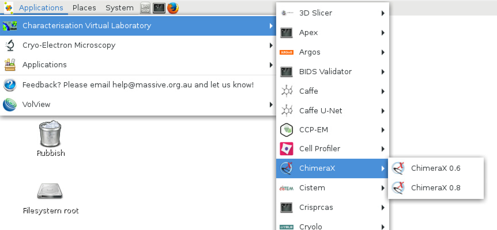

This document explains the contents of this folder.

* For each new piece of software installed to the CVL, copy the README.md file to the folder and complete the details.

* The next step is to create and test the singularity recipe for your software.

* Lastly, the menu items need to be created.
  The 'xdg' folder contains the required template files.

  For each new application to be installed a .menu and .directory file is required.

  ```
    /xdg/xdg_config/applications-merged/application/applicationName.menu
    /xdg/xdg_data/desktop-directories/applicationName.directory
  ```

  For each new application version, just the .desktop file is required.

  ```
    /xdg/xdg_data/applications/applicationName_version.desktop
  ```

  These files contain comments and hints on how to complete them. Please refer to the existing ones as a guide.

  The icon file needs to be placed in `../xdg/xdg_data/icons/hicolor/48x48/apps`
  If you don't have an icon for your application just use 'gnome-terminal.png'

  Lastly, if you application is new to the CVL, it should be added to the CVL Menu.
  Edit the file `../xdg/xdg_config/menus/cvl.menu` adding your newly created .menu file.

  If all goes well, your menu should like a bit like this:


